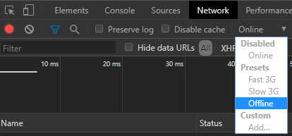
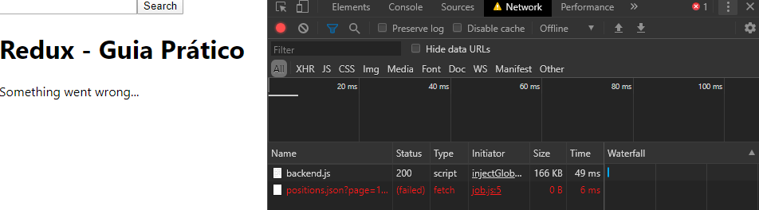

# Manipulando Erros

Para proporcionar uma melhor experiência ao usuário final, adicionaremos o tratamento de erros à aplicação.

## Mão na massa

- Faremos isto introduzindo uma action (arquivo **/src/constants/actionTypes.js**) que pode _alocar_ um estado de erro na **Redux store**:

```javascript
export const FAVORITE = 'FAVORITE';
export const FETCH_JOBS = 'FETCH_JOBS';
export const ADD_JOBS = 'ADD_JOBS';
export const FETCH_ERROR = 'FETCH_ERROR';
```

---

O próximo passo é criar um _action creator_ que mantém um objeto de erro que pode ser capturado em um reducer posteriormente.

Para isto, no arquivo **src/actions/job.js**, faça os passos:

1. Importe a action que acabamos de criar;
2. Crie e exporte a função **fetchError**

```javascript
import { ADD_JOBS, FETCH_JOBS } from '../constants/actionTypes';

export const addJobs = jobs => ({
  type: ADD_JOBS,
  jobs
});

export const fetchJobs = query => ({
  type: FETCH_JOBS,
  query
});

export const fetchError = error => ({
  type: FETCH_ERROR,
  error
});
```

---

A action já pode ser invocada na _job saga_. O **Redux Saga** utiliza as instruções _try/catch_ para tratamento de erros. Portanto, toda vez que obtivermos um erro no bloco _try_, seremos direcionados para o bloco _catch_ para fazer algo com o objeto de erro. Neste caso, vamos disparar uma nova action que irá armazenar o erro em seu devido state no Redux.

- No arquivo **src/sagas/job.js**, faça os passos:

1. Importe a função **fetchError**
2. Faça um _try/catch_
3. No bloco _catch_, faça um **yield put** para chamar a função **fetchError**

```javascript
import { call, put } from 'redux-saga/effects';
import { addJobs, fetchError } from '../actions/job';
import { fetchJobs } from '../api/job';

function* handleFetchJobs(action) {
  const { query } = action;

  try {
    const result = yield call(fetchJobs, query);
    yield put(addJobs(result));
  } catch (error) {
    yield put(fetchError(error));
  }
}

export { handleFetchJobs };
```

A lógica por trás do _try/catch_ é: **tente (try)** fazer algo. Se ocorrer algum erro, então **capture (catch)** o erro e faça alguma outra coisa. No nosso caso:

> _Tente buscar os jobs e mostre os resultados. Caso contrário, mostre o erro_.

---

Por último e não menos importante, o reducer precisa de lidar com a nova **action type**

- No arquivo **src/reducers/jobReducer.js**, vamos alterar algumas coisas para gerenciar um objeto complexo que contém a lista de jobs e um objeto de erro:

1. Altere o **INITIAL_STATE** para ser um objeto. Ele funcionará como um objeto que armazenará dois states.
2. O primeiro state é array vazio, chamado **jobs** e o outro chamado **error**, como **null**;
3. Altere a função **applyAddJobs**, para receber o state e a action, e retornar os _jobs_ como _action.jobs_ e o _error_ como _null_;
4. Importe a action **FETCH_ERROR**
5. Crie uma nova função, dê a ela o nome de **applyFetchError**, recebendo _state_ e _action_ e retornando _jobs_ como um **array vazio**, e _error_ como **action.error**;
6. Na função **jobReducer**, adicione um **case**, para a nova ação **FETCH_ERROR**, utilizando a nova função.

```javascript
import { ADD_JOBS } from '../constants/actionTypes';

const INITIAL_STATE = {
  jobs: [],
  error: null
};

const applyAddJobs = (state, action) => ({
  jobs: action.jobs,
  error: null
});

export const jobReducer = (state = INITIAL_STATE, action) => {
  switch (action.type) {
    case ADD_JOBS: {
      return applyAddJobs(state, action);
    }
    case FETCH_ERROR: {
      return fetchError(state, action);
    }
    default:
      return state;
  }
};
```

---

O **job selector** agora é um objeto complexo com uma lista de jobs e um objeto de erro. Além disso, podemos adicionar um segundo _selector_ no arquivo **src/selectors/job.js** para selecionar o objeto de erro. Ele será usado posteriormente em um componente:

```javascript
export const getAllJobs = ({ jobState }) => jobState.jobs;

export const fetchError = ({ jobState }) => jobState.error;
```

Por último, no arquivo **src/components/Jobs.js**, podemos recuperar o objeto de erro no _high order component_ e mostrá-lo com a _renderização condicional_ do React, em forma de mensagem de erro, caso um erro realmente ocorra.

```javascript
import React from 'react';
import { connect } from 'react-redux';
import { getAllJobs, fetchError } from '../selectors/job';
import Job from './Job';

const Jobs = ({ jobs, error }) => (
  <div>
    {error && <p>Algo deu errado...</p>}
    {(jobs || []).map(job => (
      <Job key={job.id} job={job} />
    ))}
  </div>
);

const mapStateToProps = state => ({
  jobs: getAllJobs(state),
  error: fetchError(state)
});

export default connect(mapStateToProps)(Jobs);
```

No browser, nas ferramentas de desenvolvedor, podemos simular uma perda de conexão para testar o erro e vê-lo em ação:



Ao tentar realizar uma chamada na API externa, buscando por algum termo, recebemos a mensagem de erro:


