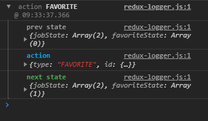

# Redux Logger (middleware)

Nesta sessão, vamos conhecer nosso primeiro middleware. Ele vai trabalhar diretamente com a _store_. Em grandes aplicações, onde muitas ações são _disparadas_, pode ser um problema rastreá-las quando há alterações, pois muitas delas podem ser acionadas implicitamente.

Portanto, vamos utilizar o middleware `redux-logger` para gerar um log de toda **action**, o estado anterior e o próximo estado, automaticamente em nossas ferramentas de desenvolvimento no navegador ao disparar uma **action**.

## Mão na massa

- Rode o comando abaixo para instalar o `redux-logger`:

```bash
yarn add redux-logger
```

- À partir de agora, podemos utilizá-lo como middleware na inicialização de nossa **Redux store**, no arquivo **src/store/index.js**.

```javascript
import { createStore, applyMiddleware } from 'redux';
import { createLogger } from 'redux-logger';
import rootReducer from '../reducers';

const logger = createLogger();

const store = createStore(rootReducer, undefined, applyMiddleware(logger));

export default store;
```

Repare que o segundo argumento do método _createStore()_ é **undefined**, pois ele é utilizado pelo _estado inicial_ da _Redux store_. Como nós trabalhamos com esse _estado inicial_ nos **reducers**, não há necessidade de definí-lo aqui.

Isso é tudo! Agora, toda vez que a aplicação disparar uma **action**, teremos um log no console do browser.

Abaixo, uma demonstração de como o log é exibido, após clicarmos no botão favorito de um item da nossa lista:


